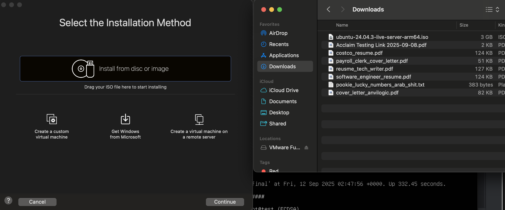
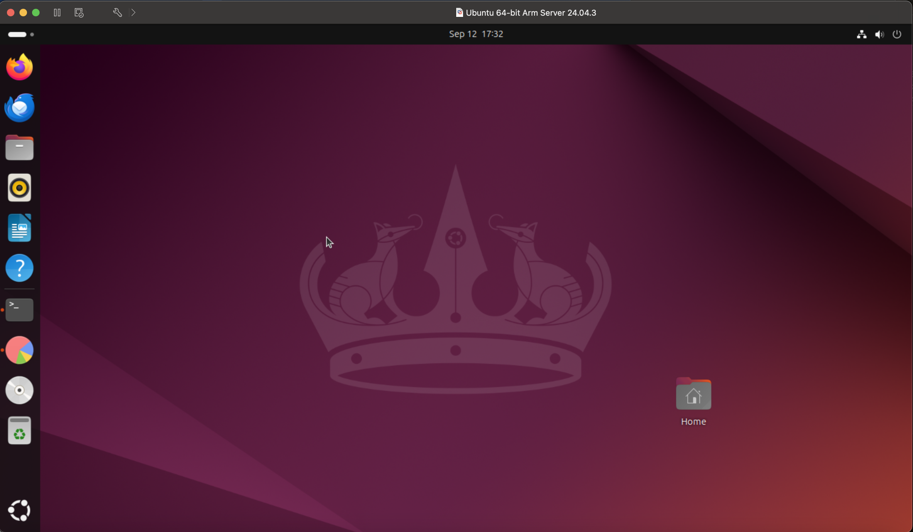
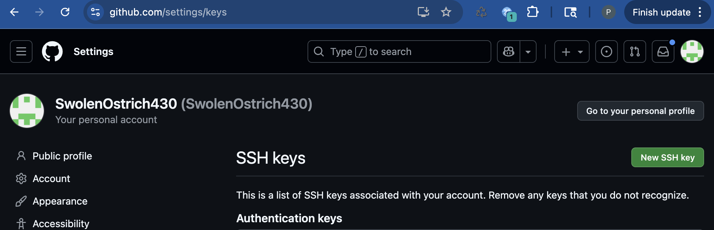

# Setup 

## Steps
### Install Docker, Helm, and Kubectl
```
brew install docker helm kubectl; 

-- maybe below not needed? 
-- brew install kubelet minikube
```

### Create an Ubuntu VM
#### Products 
* VMWare Workstation Player
* VMWare Fusion
* VirtualBox
* Hyper-V
* Ubuntu 20.04 LTS
* Parallels Desktop
* KVM 

#### Download VMWare Fusion 
* Create an account with [BroadCom](https://profile.broadcom.com/web/registration).
* Download [VMWare Fusion](https://www.vmware.com/products/desktop-hypervisor/workstation-and-fusion).

#### Download Ubuntu Iso File
* [ARM](https://ubuntu.com/download/server/arm)

#### Create VM 
In VMWare Fusion, enter `CMD + N` to create a new VM. A prompt will appear indicating that you can import a VM from an ISO file: 


From there, you'll drag your Ubuntu ISO file onto the prompt: 


And complete the setup steps as prompted. 

Once you have access to a terminal window, you can run: 

```
sudo apt update; 
sudo apt upgrade;
sudo apt install git;
sudo apt install ubuntu-desktop # or ubuntu-desktop-minimal;
sudo reboot;
```

This will download Ubuntu's desktop environment, install it, and boot it once the VM reboots. Once done, you should see the following: 


Once done, you can open a terminal window. Because we're going to need to access Github, we'll need to set up SSH keys. 

### Connect to Github
First, we'll set up our username and email in our local git config: 
```
git config --global user.name "Your Name"
git config --global user.email "your_email@example.com"
```

Next, we'll look to see if we have any existing keys: 
```  
ls -al ~/.ssh
```

If you see results, then you can skip the next step and move on to copying your public key. However, if you don't see any results, you'll need to generate a new set of keys: 

``` 
ssh-keygen -t ed25519 -C "your_email@example.com"
```

This will generate a new set of keys. You'll be prompted to enter a password for the private key. You can leave this blank. Once done, you can then add your key to the SSH Agent: 
``` 
eval "$(ssh-agent -s)"
ssh-add ~/.ssh/id_ed25519
```

And finally, you'll take your generated public key (`cat ~/.ssh/id_ed25519.pub`), and add it to your [Github account](https://github.com/settings/keys): 



If the key is correct, you should get a success message from Github, indicating that your key is ready to use. 

### Install Minikube 
Now that we have access to Github, we can install Minikube. In your Ubuntu server, run the following:

```
git clone https://www.github.com/sandervanvugt/kubestep;
./kubestep/minikube-setup.sh;
```

We can verify that minikube is installed at this point by running 

#### Build 

## Desktop and Online Tools 
* [Docker Desktop](https://www.docker.com/products/docker-desktop)
* [Kubernetes](https://console.cloud.google.com/kubernetes/overview/get-started?referrer=search&project=festive-tiger-469222-c0)
* [Helm's Artifact Hub](https://artifacthub.io/packages/search)

# Linux (Things to Learn)
## Unix 
### Fundamental Concepts 
Based on: 
* programmable shell
* users 
* groups 
* priveleged and unpriveleged instructions 
* environments 
* files and directory hierarchy
* device-independent input and output
* processes
  * maybe most importantly 

#### Kernel 
"First thing that's loaded into memory on startup and remains in memory, controlling all computer resources, until \
the computer is powered off." 

#### Entry Points 
* instruction in a program at which execution can bebin
  * can be thought of as function calls for modules 
  * "you can think of the kernel as containing a collection of separate functions, bundled together into a large \
  package, and its API as the collection of signatures or prototypes of these functions."

#### Roles and Responsibilities 
When Unix boots, firmware and software load the kernel into *system space* or *kernel space* (just a specific part of\
memory). It's there until the machine shuts down. User programs aren't allowed to  

## Commands/Things to Learn
* top 
* htop
* nice
* cgroup 
* stress
* grep 
* pgrep
* swap
* `ps`: process status
  * displays information about processes running on the system
  * `-A`|`-e`: all processes
  * `-ef`: provides a full-format listing of all processes, including details like UID, PID, PPID (Parent Process ID), CPU usage, start time, TTY (terminal type), total CPU time, and the command.
  * `aux`: display all processes with more details, including user, PID, %CPU, %MEM, VSZ (virtual memory size), RSS (resident set size), TTY, STAT (process status), START time, CPU TIME, and the COMMAND.
  * information provided: 
    * **PID** — Id for each process 
    * **USER** — user who owns or is running the process
    * **%CPU** — percentage of CPU the process is using 
    * **%MEM** — percentage of total RAM the process is using 
    * **TTY** — terminal associated with the process
    * **STAT** — current status of the process
      * e.g., running, sleeping, stopped
    * **COMMAND** — command initiated by the process
* `init`
  * `tini init`
    * [Github](https://github.com/krallin/tini)
* `apt-get`
  * `update`
  * `install`
* `exit`
* `cat`
* `/bin/false`
* `/bin/true`
* `wc`: word count 
  * `-w` — only counts number of words  
  * `-l` — only counts number of lines 
  * `-c` — only counts number of bytes 
  * `-m` — counts number of characters
    * might be different from byte count in multi-byte character encodings
  * `-L` — length of the longest line in the file 
  * can also be used with multiple files 
    * E.g., `wc -lw file1.txt file2.txt`
    * to get total of both files 
* `ls`
  * [options](https://www.tecmint.com/ls-command-in-linux/)
* `dmesg`
* `systemd`
* `journalctl`
* `stdout`
* `stderr`
* `jq`
  * json pretty printer 
* `curl`
  * `--no-buffer`
  * `-XGET`
  * `--unix-socket`
* linux oom killer 
* block i/o
  * blkio.weight cgroup attribute 
* unix signals 
  * SIGTERM 
  * USR1
  * group signal propogation 
* understand batches better 
  * terms
  * patterns
  * examples

## Things to Learn 
* scheduling/schedulers 

# Networking
## Things to Learn 
* TCP 
* TLC
* UDP

# Virtual Machines 
## Overview 
## Commands

# Docker 
## Overview
### Background 
* Containers 
  * not a new idea 
  * used to isolate and encapsulate a part of a running system 
  * used as early as batch system processes
    * which would only run one program at a time either until it was finished or a given period of time had elapsed.
* chroot 
  * system call added to Unix 7
  * it restricted a process's view of the filesystem to a single subtree 
    * I.e., you only get access to the `Documents` folder
  * most often used to protect OS from untrusted processes 
    * E.g., FTP, BIND, Sendmail
      * All of which are publicly exposed and can be compromisd 
* jail 
  * command in FreeBSD 4.0
  * allowed hosting providers to isolate individual customers on the same server.
    * I.e., Cloud providers now 
  * it restricted everything a process could do with the system and other jailed process
* modern implementations 
  * Solaris containers/Solaris Zones in Solaris 10
  * OpenVZ for Linux
  * HP's Secure Source Partitions/HP-UX Containers 
  * Linux Containers (LXC)
### Runtimes 
Docker has has four runtimes: 
* containerd (default for Docker and Kubernetes)
* runc (default lower-level runtime for containerd)
* crun (written in C and designed to have a small memory footprint)
* runC (written in Go and designed to have a small memory footprint
* Kata Containers
* gVisor
* Nabla Containers 

### Architecture 
* Main components = client-server model 
  * Two required parts: 
    * client (docker)
    * daemon (dockerd)
      * builds, runs, and manages containers
      * also manages: 
        * containerd
        * shim-runc-v2
          * used to interact with runc and containerd
  * Registry (optional) 
    * stores images and their metadata
  * Docker hosts will have:
    * 1 Docker server/daemon
      * which can manage 1 or more container 
    * You can then communicate to the host over CLI (docker) or from the server itself.
* Client 
  * Docker CLI 
  * Docker API 
  * Docker Compose 
  * Docker Swarm 
  * Docker Machine 
  * Docker App 
  * Docker Desktop 
  * Docker Engine 
* Difference between VMs 
  * VMs run a complete Linux kernel and OS
    * On top of a hardware virtualization layer (hypervisor)
  * Containers all share a single kernel 
    * and isolation between workloads is implemented inside the kernel (operating system virtualization)
  * libcontainer's definition: 
    * "A container is a self-contained execution environment that shares the kernel of the host system and is (optionally) isolated from other containers in the system."
  * 

### Definitions 
* <b>Container</b>—a solution that runs code (an application) in an isolated environment.
* <b>Image</b>—a file that contains all the code and dependencies needed to run a container.
* <b>Container Registry</b>—a place where you can store your images.
* <b>Container Runtime</b>—a program that runs containers. It allows for containers to run on any machine regardless of OS. Provides key features: image management, accessibility, storage, security, logging, and monitoring.
* <b>Podman</b>—an alternative built on top of Docker.
* <b>Bind Mount</b>—
* <b>Virtual Machine</b>—

## Commands
### CLI
* `docker build` — creates an image from a Dockerfile. See [docs](https://docs.docker.com/build/concepts/overview/)
  * -t — name and optionally a tag in the 'name:tag' format. 
  * -f — allows you to set the directory build should be running under 
* `docker create` 
* `docker start`
* `docker run` ([here](https://docs.docker.com/reference/cli/docker/container/run/) in case any of these are wrong)
    * -d detached—runs the container in the background
    * -i interactive—keeps stdin/out open
    * -t tty—runs the container with a shell attached. 
    * -p port forwarding—sets the port to forward from the container to the host. E.g., `docker run -p <host_port>:<container_port>`. I.e., the host_port will accept connections and move those to the container_port on the actual container. 
    * -v volume mounting—ensures that the host's file system is mounted inside the container. Giving you access to the host's file system/storage. See [Bind Mount] (https://docs.docker.com/engine/storage/bind-mounts/). E.g., `docker run -v <host_path>:<container_path>`
    * -e environment variable
    * -n name
    * --name naming—gives your container a name. E.g., `docker run --name <the_name> busybox`
    * --rm remove on exit—removes the container when it exits. I.e., runs `docker rm <container_id>` once the container exits.
    * --restart restart policy
    * --env environment variables
    * --network network
    * --volume volume
    * --publish publish. E.g., `--publish mode=ingress,target=8080,published=8080`
* `docker ps`-- or pods list, lists all running containers
    * -a all — i.e., all containers, not just running ones. 
    * -l last created
    * -q only container id
    * -f filter
    * --all all
    * --last last
    * --quiet quiet
    * --filter filter
* `docker container export` — exports a container as a tarball. E.g., `docker container export ddc3f61f311b -o web-app.tar`
* `docker logs`
* `docker inspect` — shows details about a container. E.g., `docker inspect <container_id>`.
* `docker start`—starts a stopped container. E.g., `docker start <container_id>`.
* `docker stop`—forces the provided container to exit once it's running. E.g., `docker stop <container_id>`.
* `docker rm`—removes any files relates to the provided container. E.g., `docker rm <container_id`. 
* `docker images` — lists all current images available to run. 
* `docker login`
* `docker push`
* `docker pull`
* `docker tag`
* `docker rmi`
* `docker system prune`
* `docker exec`
* `docker system df`
* `docker system info`
* `docker system prune`
* `docker context list` — 
* `docker search` — 

### Dockerfile 
* `FROM` -- like "require" or "import". E.g., `FROM gcc:latest`
* `WORKDIR` -- sets the working directory for the rest of the Dockerfile. E.g., `WORKDIR <working_directory>`
* `COPY` -- copies the current path on host to the destination path in the container. E.g., `COPY <source_path_host> <destination_path_container>` 
* `RUN` -- executes a command in the container. E.g., `RUN gcc -o hello hello.c`
* `CMD` -- sets the default command to run when the container is started. E.g., `CMD ["./hello"]`
* `ENTRYPOINT` -- sets the default command to run when the container is started. E.g., `ENTRYPOINT ["./hello"]`
* `EXPOSE` -- sets the port to expose. E.g., `EXPOSE 8080`
* `ENV` -- sets an environment variable. E.g., `ENV <variable_name> <variable_value>`
* `VOLUME` -- sets a volume. E.g., `VOLUME <volume_name>`
* `ENTRYPOINT`
* `EXPOSE`— sets the port that you want to allow listening on. E.g., `EXPOSE 8080`. 
* `USER` — sets the user to run the container as. E.g., `USER <user_name>`. By default, everything runs as root. Should almost always run as a regular, unprivileged user. 
* `ARG` — creates params and sets defaults for those params. E.g., `ARG email="email"`
* `LABEL` — allows you to create key-value pairs that can be used to identify images/containers. `docker image inspect` allows you to see labels applied to an image.

#### Example Dockerfile 
```
FROM gcc:latest 
WORKDIR /usr/src/app 
COPY . . 
RUN gcc -o hello hello.c 
CMD ["./hello"]
```

You would then run `docker build -t hello .` to build the image.

### Building Images 

### Docker Registries 
<b>Offerings</b>
* Docker Hub
    * For public registries
* Google
* GitHub
* Quay.io

#### Authenticating to a Registry
First, you'll need to create a [Docker Hub account](https://hub.docker.com/). Once done, you can login to your account on the CLI with `docker login`. You can also create a `config.json` file in your ${HOME}/.docker directory. You can then use `docker logout` to logout of the application. Your credentials file will then be cleared of any account information.  

You can also use other credentials managers to authenticate. See examples [here](https://github.com/docker/docker-credential-helpers). 

#### Pushing to and Pulling from a Registry 
Once an image has been built, you can push it to a registry. The first thing you'll need to do is tag your built image. 

To do this, you can run:
```shell
docker tag example/docker-node-hello:latest \
  docker.io/${<my_docker_hub_user>}/docker-node-hello:latest
```

You can then check that the image has been tagged as expected: 
```shell
docker image ls ${my_docker_hub_user}/docker-node-hello
```

Once done, you can upload the image:
```shell    
docker push ${my_docker_hub_user}/docker-node-hello:latest
```

And then check that it's been uploaded as expected with: 
```shell
docker image pull ${my_docker_hub_user}/docker-node-hello
Using default tag: latest
latest: Pulling from myuser/docker-node-hello
Digest: sha256:f5ceb032aec36fcacab71e468eaf0ba8a832cfc8244fbc784d040872be041cd5
Status: Image is up to date for myuser/docker-node-hello:latest
docker.io/myuser/docker-node-hello:latest
```
The `docker search` command also can be used to see if you've pushed the image successfully.

#### Creating a Private Registry
TODO: add to it 

### Optimizing Images 
In general, you should only have what is necessary to run and debug the image. Alpine Linux is a good, lightweight operating system to use for this. 
* TODO: find exercises for optimizing image size 
* TODO: fool around with different ways to layer things 
* TODO: look into sidecars? 

#### Multistage Builds
Example: 
```dockerfile
# Build container
FROM docker.io/golang:alpine as builder
RUN apk update && \
    apk add git && \
    CGO_ENABLED=0 go install -a -ldflags '-s' \
    github.com/spkane/scratch-helloworld@latest

# Production container
FROM scratch
COPY --from=builder /go/bin/scratch-helloworld /helloworld
EXPOSE 8080
CMD ["/helloworld"]
```

`scratch` here is a reserved word which tells Docker start from an empty base image. The `COPY --from=builder` command copies the binary from the builder container to the production container. 

You can have as many stages as needed and can copy files from as many generated binaries from intermediate builds as needed. 

One thing that you should make sure to do is to clean your package manager's cache. I.e., on Fedors, you could do `dnf clean all`. But, this needs to be done in the same line as the install. I.e.,
```dockerfile
RUN apt update && apt install node && apt clean all
```

#### Using Layer Cache
#### Multi-Arch Images 

### Running Images (Creating Containers)
* docker container run
  * convenience for: 
    * `docker create`
    * `docker start`
* access to the above two commands directly 
  * makes more configuration available to you 
* Dockerfiles only provide default values for different variables/config values 
  * all can be overridden via the CLI at time of execution  

#### Container Configuration Options 
##### Naming  
* `docker conatiner create|start|run --name <name>`

##### Labeling
* Key-val pairs used to apply metadata 
* conatiners automatically inherit all labels from parent image 
  * additional labels can be applied at runtime
    * E.g., 
      * `docker conatiner run -l deployer=Me -l tester=You`
* You can then view the labels on a specific container with `inspect`:
  * `docker container inspect has-some-labels`

##### Search 
* base list command is `docker container ls`
  * `-a` searches for all ??
  * `-f` applies a filter
    * e.g., `-f label=deployer=Ahmed`
      * Can also filter for name, status, or Id
  * `-s --size` displays the total size of returned containers 
    * specific to containers

##### Hostname 
* By default when container is started 
  * *etc/hostname* automatically gets copied 
    * into config directory on host
    * other files also sent there 
  * a link is then made between that copy with the original 
    * created with a *bind mount*
  * In a running container, you can run `mount`
    * the line with the *mount point* set to *etc/hostname*
      * should be there
      * and running `hostname -f` should show you the actual value
  * Running container example for above if wanted ^
    * `docker container run --rm -ti ubuntu:latest /bin/bash`
      * if the image has an entrypoint 
        * then the final argument is passed to the entrypoint as command-line args 
      * otherwise it is run as command line args in the container 
* Can be set with: 
  * `docker container run --hostname="mycontainer.example.com"`

##### Domain Name Service 
Defaults to Docker host's *resolve.conf* file. If you want to change this, you can run: 
```shell
docker container run --rm -ti --dns=8.8.8.8 --dns=8.8.4.4 \
    --dns-search=example1.com --dns-search=example2.com \
    ubuntu:latest /bin/bash
```

Which would generate an */etc/resolv.conf* file on the container:
```text
nameserver 8.8.8.8
nameserver 8.8.4.4
search example1.com example2.com
```

##### MAC Address 
By default, the prefix is *02:42:ac:11*. You can set it with: 
```shell 
docker container run --rm -ti --mac-address="a2:11:aa:22:bb:33" \
  ubuntu:latest /bin/bash
```

##### Storage Volumes 
* Sometimes a contianer's alotted disk space might not be sufficient.
* You can use `--mount/-v <a_full_path>` 
  * to mount directories and files from the host server to the container

E.g., 
```shell
docker container run --rm -ti \
  --mount type=bind,target=/mnt/session_data,source=/data \
  ubuntu:latest /bin/bash
```

Here, `--mount type=bind` can be shortened to `-v` like: 
```shell
docker container run --rm -ti \
  -v /mnt/session_data:/data:ro \
  ubuntu:latest /bin/bash
```

Where the target and source are separated by a colon. `:ro` specifies read only access for the `-v` version.\
`,readonly` is the equivalent for `--mount`. If you want to share a volume mount between container, you can use the \
`z` option. THIS SHOULD ONLY BE DONE IF NEEDED AND SHOULDN'T BE DONE TO */etc* or */var*.

You can also add a temp filesystem to the container with the option, `--mount type=tmpfs`. Any data here will be lost \
when the container stops. You can set a size with: 
```shell
docker container run --rm -ti --read-only=true \
  --mount type=tmpfs,destination=/tmp,tmpfs-size=256M \
  ubuntu:latest /bin/bash
```

**Note**: if the mount point doesn't exist on the host machine, it'll be created by default as a directory. 

##### Resource Quotas
Docker has to rely on the `cgroup` in Linux kernel to control resources available to each container. 

You can provision resource limitations with CLI arguments with `docker container create|run`. Config options include:
* CPU
* memory
* swap
* storage I/O 

You can run `docker container update` to change any of these settings while a container is running. Or you can \
deploy a new container. **Your kernel does have to support all of these operations and provide access to them.** \
Docker has the `docker system info` command to check if any privileges or config options are missing in the response.\
Docker has good [documentation](https://docs.docker.com/engine/install/linux-postinstall/#your-kernel-does-not-support-cgroup-swap-limit-capabilities)\
on how to work with each kernel. 

##### CPU Shares 
Original method for limiting CPU usage by applications in containers: 
* **full pool of shares**: computing power of all CPU cores in a system
* Docker uses the number 1024 to represent the full pool.
  * You can configure how much time a container gets to use the CPU 
    * by configuring CPU shares
  * E.g., a container allocated 512 shares will run twice as long as one that has 256 allocated to it.
  * These aren't hard-and-fast limits, they're relative 
    * "Since the CPU is not busy, the limit on the CPU shares would have only a limited effect because there is no competition in the scheduler pool. When a second container that uses a lot of CPU is deployed to the same system, suddenly the effect of the constraint on the first container will be noticeable. Consider this carefully when constraining containers and allocating resources."

##### CPU Planning 
* You can also "pin" a container to specific CPUs
  * I.e., it can only be scheduled to process jobs on those CPUs

See: 
```shell
docker container run --rm -ti \
  --cpu-shares 512 --cpuset-cpus=0 spkane/train-os \
  stress -v --cpu 2 --io 1 --vm 2 --vm-bytes 128M --timeout 120s
```

"Using the CPU Completely Fair Scheduler (CFS) within the Linux kernel, you can alter the CPU quota for a given container by setting the --cpu-quota flag to a valid value when launching the container with docker container run."

##### Simplifying CPU Quotas 
The `--cpus` command allows you to set the relative number of CPUs a container should use. The value must be bewteen \
the 0.0 and the number of CPUs available. Any number outside of that range will throw an error. \
`docker container update --cpus=<num_cpus>` can also be used to add CPUs after the initial build.

##### Memory 
Memory limits on a container are hard-limits (because of how virtual memory works in Linux). `--memory` accomplishes this.

When used alone, the value will represent both the amount of RAM and swap. `b`, `k`, `m`, and `g` are suffixes for \
units. You can use the `--memory-swap` option to set or disable swap:
```shell
docker container run --rm -ti --memory 512m --memory-swap=768m \
    spkane/train-os stress -v --cpu 2 --io 1 --vm 2 --vm-bytes 128M \
    --timeout 10s
```

Here, the container gets 512 MB of RAM and another 256 MG of swap. If swap is set to -1, then you'll have unlimited swap. \
If `--memory` and `--memory-swap` are set to the same value, you'll have no swap.

##### Block I/0
`--blkio-weight` or `--blkio-weight-device` (for a specific device) allows you to set the blkio.weight cgroup attribute.  

##### ulimits 
Prior to cgroups, you could limit the resources available to a specific user with `ulimit`. \
[Docs](https://www.linuxhowtos.org/Tips%20and%20Tricks/ulimit.htm) are available for actual use cases. 

#### Starting a Container 
* command: `docker container start`
* normal flow: 

```shell
# create a redis instance 
docker container create -p6379:6379 redis:7.0;
# filter to find the container's ID to use in the start command 
docker container ls -a --filter ancestor=redis:7.0;
docker container start <id_returned_from_ls_command>;
# and then verify that the container has a 'STATUS' of 'Up...'
docker container ls
```

#### Auto-Restarting a Container 
Docker can manage restarts for you with the `restart` argument. It takes the following values: 
* `no`: container never restarts.
* `always`: restart whenever it exits.
* `on-failure`: restart whenever it exits with a nonzero exit code.
* `unless-stopped`: restarts on exit unless explicitly told so.

#### Stopping a Container 
* `docker container stop <container_id>`
  * Sends a SIGTERM signal 
    * and waiting for the container to gracefully exit 
  * `-t <num_seconds>`
    * send SIGTERM 
      * but if container hasn't stopped within `num_seconds`, Docker sends a `SIGKILL` to kill the container.  

#### Killing a Container 
* `docker container kill --signal=USR1 <container_id>`
  * here, `--signal` allows you to send a signal to the container 
* you can start containers after you've killed them  

#### Pausing and Unpausing a Container 
"There are a few reasons why we might not want to completely stop our container. We might want to pause it, leave its \
resources allocated, and leave its entries in the process table. That could be because we’re taking a snapshot of its\
filesystem to create a new image or just because we need some CPU on the host for a while. If you are used to normal \
Unix process handling, you might wonder how this works since containerized processes are just processes."

"Pausing uses [`cgroup freezer`](https://www.kernel.org/doc/Documentation/cgroup-v1/freezer-subsystem.txt).
Which prevents your process from being scheduled until you unfreeze."

This isn't caused by a signal — just no information gets sent to the process (container). 

Command: `docker container pause` | `docker container unpause <container_id>`

#### Cleaning Up Containers and Images 
* Delete Container: `docker container rm <container_id>`
* Delete Image: `docker image rm <image_id>`
  * can only do if there are no more containers using the image 
* Purge non-essential containers and images: 
  * `docker system prune`
    * `-a`: removes all unused images
      * not just "dangling" ones
* Delete all containers on Docker host:
  * `docker container rm $(docker container ls -a -q)`
* Delete all images on host:
  * `$ docker image rm $(docker images -q)`
* Remove all containers that exited with non-zero state
  * `$ docker container rm $(docker container ls -a -q --filter 'exited!=0')`
* Remove all containers that exited with a non-zero status
  * `$ docker container rm $(docker container ls -a -q --filter 'exited!=0')`
* Remove all untagged images: 
  * `$ docker image rm $(docker images -q -f "dangling=true")`
* More [filtering options](https://docs.docker.com/reference/cli/docker/container/ls/#filtering)
* Tips: 
  * Maybe useful to have scheduled job(s) that prune the host
    * can run with `cron` or `systemd`

### Monitoring/Tooling 
* `docker version` 
* `docker system info`
* changing root directory for images and containers 
  * default: */var/lib/docker*
  * `sudo dockerd \
        -H unix:///var/run/docker.sock \
        --data-root="/data/docker"
  `
* configuration file:
  * default: /etc/docker/daemon.json
  * most options to `dockerd` can be set in this file 
* `docker image pull <image>:<version>`
  * this is just pulling the image 
  * not actually applying it to current containers 
  * safest way to refer to each image/version combination
    * E.g., `docker image pull <image>@<content_addressable_tag>`
* `docker container inspect <container_id>`
* getting into ("execing" into) a container
  * `docker container exec <command/process>`
    * `-i` — interactive 
    * `-t` — pseudo TTY 
    * `-d` — detached 
      * shouldn't do this in prod
    * supported by both `dockerd` and `docker` 
    * can run any process, not just a shell 
      * but a shell is the easiest way to fool around
    * e.g., `docker container exec -it 9f09ac4bcaa0 /bin/bash`
  * `nsenter`
    * more Linux-native way of doing it
* volumes 
  * `docker volume ls`discover all volumes in the root directory 
      * and provide view into where they are on the server + other stats
    * these aren't bind-mounted 
      * they're data containers used for persistant storage
  * `docker volume create my-data`
  * `docker volume inspect my-data`
  * attach that volume to a container 
    * `docker container run --mount source=my-data,target=/app`
      * where `target` indicates where a container will access that information
  * delete the volume
    * `docker colume rm my-data`
* monitoring 
  * `docker container stats <container_id|name>`
    * Output:
      * container Id
      * %CPU 
        * 100% = 1 CPU core
      * %MEM 
        * amount of memory in use and maximum allowed
        * common issue where not enough memory is allocated 
          * and the kernel's OOM killer stops the container repeatedly
      * Number of active processes
    * `/stats/` endpoint 
      * streams statistics as long as the connection is open
      * if needed to do in production
        * will need to expose the API to a TCP port 
          * [docs](https://docs.docker.com/engine/security/protect-access/)
          * security is a concern here 
      * to test while on the actual docker server 
        * run `curl --no-buffer -XGET --unix-socket /var/run/docker.sock http://docker/containers/stress/stats`
  * health checks 
    * containers from Dockerhub or shared repos can implement a standard health-checking mechanism
      * done in the dockerfile 
      * with `HEALTHCHECK`
        * tells the daemon a command it can run to see if the container's healthy or not
        * references: 
          * https://docs.docker.com/engine/reference/builder/#healthcheck
          * https://docs.docker.com/compose/compose-file/#healthcheck
        * the healthcheck will the run when the image is built 
          * `docker image build -t mongo-with_check:5.0`
          * `docker container inspect --format='{{json .State.Health}}' mongo-hc | jq`
  * `docker system events`
    * dockerd generates an events stream around the container's lifecycle 
      * can tap into that stream with the above command
      * opens a long-lived hTTP request 
        * returns JSON blobs as they get sent
    * common events: 
      * `container create`
      * `contianer attach`
      * `network connect`
      * `container start`
      * `container die`
      * `network disconnect`
      * `container destory`
      * `container oom`
        * a container is out of memory
      * `container exec_create|exec_start|exec_die`
        * when someone used the `docker conatainer exec` to enter a container
    * options 
      * `--since`
      * `--until`
  * `cAdvisor`
    * Google's open source container monitoring tool 
    * [install directions](https://github.com/google/cadvisor)
    * you can see the gui at `localhost:8080`
    * [rest api](https://github.com/google/cadvisor/blob/master/docs/api_v2.md)
  * [Prometheus](https://prometheus.io/) 
    * docker has an endpoint specifically for prometheus 
    * for monitoring the docker server
      * not containers 
    * to export metrics to prometheus 
      * `dockerd` needs to expose metrics listeners on a configurable port 
        * E.g., `--experimental --metrics-addr=<the_port>`
        * These can also be configured in the *daemon.json* config file
        * You'll need to restart the dockerd server once this has been applied 
          * `sudo systemctl restart docker`
        * Once done, you can call the metrics endpoint:
          * `curl -s http://localhost:9323/metrics`
    * to enable prometheus 
      * create the file: */tmp/prometheus/prometheus.yaml*
      * see *./examples/prometheus/config.yaml* for an example file
* logging 
  * default: 
    * `json-file` method 
      * runs the `json-file` logging plugin
    * `docker conatiner logs <image_name>/<container_id>` 
      * exposes most users to the plugin
      * `--since` — display logs after a date
        * E.g., `--since 2002-10-02T10:00:00-05:00`
        * Unix timestamp, standard timestamp, or Go duration also allowed
      * `--tail <number_of_lines_to_see>`
      * `-f` 
        * also works the same but will keep the connection open and add new lines from the log file 
    * the actual files are on the docker server in */var/lib/docker/containers/<container_id>*
      * in the *<container_id>-json.log* file 
  * other options
    * set log driver with 
      * `--log-driver=<log_provider>`
      * options: 
        * `syslog `
          * "simplest for running docker at scale"
          * most Linux systems have a syslog receiver
            * `syslog` or `rsyslog`
        * `fluentd`
        * `journald`
        * `gelf`
        * `awslogs`
        * `splunk`
        * `gcplogs`
        * `local`
        * `logentries`
  * Most logging plugins are blocking my default 
    * To make non-blocking:
      * `--log-opt mode=non-blocking`
      * `--log-otp max-buffer-size=4m`
      * if logs fill up buffer 
        * oldest loglines in memory dropped

### Debugging Containers 
`docker container top <conatiner_id|name>` allows you to see a list of processes running in the container. \
which produces the same result as a `ps` command. 

### Tips 
* .dockerignore works the same as .gitignore. Adding ".git" should probably be default.

### Things to Learn Later 
* Docker Buildkit 
* [Building base images](https://docs.docker.com/build/building/base-images/)
* [Creating a Private Docker Registry](https://www.youtube.com/watch?v=nukI2Mz_xqI)
* tarballs (`tar -tvf <the_file>/tar`)
* directory caching 
* [libcontainer](https://github.com/opencontainers/runc/tree/main/libcontainer)
* [bind mounting](docker container export ddc3f61f311b -o web-app.tar)

## Works "Cited" 
* [Docker Up and Running 3rd Edition](https://learning.oreilly.com/library/view/docker-up/9781098131814/)

# Kubernetes 
## Overview 
## Definitions
### Container Orchestration Basics 
* <b>Container Orchestration</b>—"automated managemnt of containerized applications and microservices. Common functions include: 
  * manage relationships between containers in a microservice
  * add scalability to keep up with load 
  * monitor pods to ensure that if an instance goes down, another can come up
  * load balancing to ensure that requests are distributed evenly across all instances
  * resource management to ensure that the system has access to the resources it needs
  * network routing to ensure that requests are routed to the correct pods
  * service discovery to ensure that pods are available when needed
  * logging and monitoring to ensure that the system is working as expected"
* <bContainer Orchestration Providers</b>
  * Kubernetes
    * Serves as the standard. "Google published the specification of their internal container orchestrator, Borg."
    * Borg papers and resources: 
      * [Large-scale cluster management at Google with Borg](https://static.googleusercontent.com/media/research.google.com/en//pubs/archive/43438.pdf)
      * [Borg: A Cluster Management System](https://medium.com/@adityashete009/borg-large-scale-cluster-management-system-cbdcc4f8eb91)
  * Docker Swarm
  * Mesos
  * Nomad
  * Rancher
    * On-prem distribution of Kubernetes. 
  * Amazon ECS
    * AWS' managed container orchestration service.
    * built on proprietary container orchestration software.
  * Amazon EKS
    * AWS' managed kubernetes service.
    * built on proprietary container orchestration software.
  * Azure ACS
    * Microsoft's managed container orchestration service.
    * built on proprietary container orchestration software.
  * Azure AKS
    * Microsoft's managed kubernetes service.
  * Google Kubernetes Engine
    * Managed Kubernetes service. 
  * OpenShift
    * On-prem distribution of Kubernetes.
  * CoreOS Fleet
  * CoreOS Tectonic
### Kubernetes Components
* <b>[apiserver](https://kubernetes.io/docs/reference/command-line-tools-reference/kube-apiserver/)</b>—config/data provider for all api objects (pods, services, replicationcontrollers, etc). Accepts REST calls and gives view into a "cluster's shared state through which all other components interact."
* <b>[Container Runtime Interface](https://kubernetes.io/docs/concepts/architecture/cri/)</b>—plugin interface which enables the kubelet to use a wide variety of container runtimes, without having a need to recompile the cluster components.
* <b>[Kubelet](https://kubernetes.io/docs/reference/command-line-tools-reference/kubelet/)</b>—responsible for ensuring that all components on its assigned node are running as described in a provided set of PodSpecs. The Kubelet receives PodSpec either from the apiserver (most common), a file passed on the command line, or an HTTP endpoint. Different version from Kube docs: Kubelets are described as the primary "node agent" on each node. They register each node with the apiserver.  
* <b>Node Agent</b>
* <b>Node</b>
* <b>[apiserver](https://kubernetes.io/docs/reference/command-line-tools-reference/kube-apiserver/)</b>
* <b>Namespace</b>
* <b>Label</b>
* <b>Selector</b>
* <b>Resource</b>
* <b>ResourceQuota</b>
* <b>LimitRange</b>
* <b>ConfigMap</b>
* <b>Secret</b>
* <b>PersistentVolume</b>
* <b>Pod</b>
* <b>PodSpec</b>—a YAML or JSON object that describes a pod. The kubelet takes a set of PodSpecs that are provided through various mechanisms (primarily through the apiserver) and ensures that the containers described in those PodSpecs are running and healthy. The kubelet doesn't manage containers which were not created by Kubernetes.
* <b>Deployment</b>
* <b>Service</b>
* <b>replicationcontrollers</b>
* <b>Ingress</b>
* <b>DaemonSet</b>
* <b>StatefulSet</b>
* <b>CronJob</b>
* <b>Job</b>
* <b>ReplicaSet</b>
* <b>Minikube</b>—
## Commands
## Resources 

# Helm 
## Overview 
## Resources 
* [Helm Hub](https://artifacthub.io/packages/search?kind=0)

# Resources
## Cache
### Redis
